<div align="center">

<!-- Animated Header -->


<!-- Typing SVG -->
<a href="https://git.io/typing-svg"></a>

<!-- Social Badges -->
<p align="center">
  <a href="https://hackingepico.com" target="_blank">
    
  </a>
  <a href="https://www.linkedin.com/in/andres-lorente/" target="_blank">
    
  </a>
  <a href="https://app.hackthebox.com/profile/1357718" target="_blank">
    
  </a>
  <a href="mailto:andreslorente.dev@gmail.com">
    
  </a>
</p>

<!-- Visitor Badge & Profile Views -->
<p align="center">
  
  
  
</p>

</div>

---

## 👨‍💻 Professional Profile

```python
#!/usr/bin/env python3

class SeniorSysAdminAndSecuritySpecialist:
    def __init__(self):
        self.name = "Andrés Lorente"
        self.role = "Senior Systems Administrator & Cybersecurity Specialist"
        self.location = "Málaga, Spain 🇪🇸"
        self.experience = "20+ years in IT Infrastructure & Systems Administration"
        self.education = "42 Málaga Student"
        self.certifications = ["eJPTv2"]
        self.current_focus = "OSCP Certification & Advanced Security"

    def get_professional_summary(self):
        return {
            "core_expertise": [
                "Systems Administration (Windows & Linux)",
                "Cloud Infrastructure (AWS, Oracle Cloud)",
                "Cybersecurity & Penetration Testing",
                "DevOps & Automation",
                "IT Support & Infrastructure Management"
            ],
            "transition_path": "Leveraging 20+ years of SysAdmin experience to specialize in offensive security and penetration testing",
            "unique_value": "Deep understanding of infrastructure + security mindset = comprehensive protection strategies"
        }

    def get_current_activities(self):
        return [
            "🏢 Managing enterprise IT infrastructure (Windows/Linux)",
            "☁️ Architecting cloud solutions (AWS, Oracle Cloud)",
            "🔒 Implementing security measures & penetration testing",
            "🤖 Building AI automation workflows (Copilot Studio, n8n)",
            "🐳 Orchestrating containerized environments (Docker, Portainer)",
            "📚 Preparing for OSCP certification",
            "🛡️ Monitoring network security (Suricata, Evebox)"
        ]

me = SeniorSysAdminAndSecuritySpecialist()
print(me.get_professional_summary())
```

---

## 💼 Professional Experience & Expertise

<div align="center">

### 🏆 20+ Years of Systems Administration Excellence

</div>

<table>
<tr>
<td width="50%" valign="top">

### 🖥️ **Systems Administration**
- **Windows Server** (Active Directory, GPO, WSUS)
- **Linux Administration** (Debian, Ubuntu, RHEL, Kali)
- **Office 365 Administration** (Exchange, Teams, SharePoint)
- **Jira Administration** (Project Management, Workflows)
- **IT Support & Helpdesk** (Enterprise Level)
- **Infrastructure Management** (On-premise & Cloud)

### ☁️ **Cloud & Infrastructure**
- **AWS** (EC2, S3, VPC, IAM, CloudWatch)
- **Oracle Cloud** (OCI, Compute, Networking)
- **Hybrid Cloud Architectures**
- **Infrastructure as Code** (Terraform basics)
- **Backup & Disaster Recovery**

</td>
<td width="50%" valign="top">

### 🤖 **Automation & DevOps**
- **AI Agent Development** (Microsoft Copilot Studio)
- **Workflow Automation** (n8n, Make)
- **Containerization** (Docker, Portainer)
- **Bash Scripting** (Advanced automation)
- **Python Development** (Tools & Scripts)
- **CI/CD Pipelines** (GitHub Actions)

### 🛡️ **Cybersecurity & Network Security**
- **Penetration Testing** (eJPTv2 Certified)
- **Network Security Monitoring** (Suricata, Evebox)
- **Security Hardening** (Linux, Windows)
- **Vulnerability Assessment** (Nmap, Nuclei, Nessus)
- **Incident Response** (Log Analysis, SIEM)
- **OSCP Preparation** (HTB, Offensive Security Labs)

</td>
</tr>
</table>

---

## 🛡️ Certifications & Continuous Learning

<div align="center">

| Certification | Status | Year | Focus Area |
|--------------|--------|------|------------|
| 🎖️ **eJPTv2** (eLearnSecurity Junior Penetration Tester) | ✅ Certified | 2024 | Offensive Security |
| 🎯 **OSCP** (Offensive Security Certified Professional) | 🔄 In Progress | 2025 | Advanced Pentesting |
| 🏫 **42 Málaga** (Computer Science Curriculum) | 📚 Student | Ongoing | Software Engineering |
| 💼 **20+ Years SysAdmin Experience** | ✅ Proven Track Record | 2000-2025 | Enterprise IT |

</div>

---

## 💻 Technical Skills & Tools

<div align="center">

### 🔴 Offensive Security & Pentesting


### 🛡️ Network Security & Monitoring


### 💾 Programming & Scripting


### 🐧 Operating Systems & Servers


### ☁️ Cloud Platforms & Services


### 📊 Administration & Management Tools


### 🤖 Automation & AI


### 🐳 Containerization & Orchestration


### 🔧 DevOps & Version Control


### 🛠️ Development & Editors


</div>

---

## 🚀 Featured Projects & Tools

<div align="center">

<a href="https://github.com/4ndymcfly/4ndy-bspwm">
  
</a>

<a href="https://github.com/4ndymcfly/xpather">
  
</a>

<a href="https://github.com/4ndymcfly/choice-nmap">
  
</a>

<a href="https://github.com/4ndymcfly/grepanizer">
  
</a>

</div>

### 🔥 Project Portfolio

| Project | Category | Description | Tech Stack |
|---------|----------|-------------|------------|
| [**4ndy-bspwm**](https://github.com/4ndymcfly/4ndy-bspwm) | 🔧 Infrastructure | Professional Kali Linux hacking environment with bspwm. 144 automated tests, CI/CD, security hardened. | Bash, Python, Docker, CI/CD |
| [**xpather**](https://github.com/4ndymcfly/xpather) | 🔐 Security | XML document brute force analysis tool for penetration testing | Python, XML |
| [**choice-nmap**](https://github.com/4ndymcfly/choice-nmap) | 🔍 Network | Interactive network scanning interface with enhanced nmap output parsing | Bash, Nmap |
| [**grepanizer**](https://github.com/4ndymcfly/grepanizer) | 📊 Analysis | Advanced nmap output analyzer for IP range scans and reporting | Bash, Regex |
| [**addd**](https://github.com/4ndymcfly/addd) | ⚙️ Automation | Bash utility for managing /etc/hosts entries during pentesting engagements | Bash |
| [**42env**](https://github.com/4ndymcfly/42env) | 🎓 Education | Configuration automation script for 42 school students | Bash |

---

## 🎯 Professional Value Proposition

<div align="center">

### 🌟 Why My Profile Stands Out

<table>
<tr>
<td align="center" width="33%">


**Deep Infrastructure Knowledge**

20+ years managing enterprise systems provides unparalleled understanding of infrastructure vulnerabilities and attack surfaces

</td>
<td align="center" width="33%">


**Security-First Mindset**

Combining SysAdmin experience with offensive security creates a unique perspective for both attacking and defending systems

</td>
<td align="center" width="33%">


**Automation Expert**

Proficient in automating security workflows, infrastructure deployment, and creating AI-powered solutions

</td>
</tr>
</table>

</div>

---

## 📊 GitHub Statistics

<div align="center">


</div>

<div align="center">

<!-- GitHub Streak Stats -->


</div>

<div align="center">

<!-- Activity Graph -->


</div>

---

## 🏆 HackTheBox & CTF Achievements

<div align="center">

<a href="https://app.hackthebox.com/profile/1357718" target="_blank">
  
</a>

### 🎮 Active in Cybersecurity Community

<table>
<tr>
<td align="center">
  
</td>
<td align="center">
  
</td>
<td align="center">
  
</td>
</tr>
</table>

*Continuously sharpening offensive security skills through practical challenges and real-world scenarios*

</div>

---

## 🎓 Professional Development Path

```mermaid
graph TB
    A[20+ Years SysAdmin] --> B[IT Infrastructure Expert]
    B --> C[Cloud Architecture]
    B --> D[Security Hardening]
    C --> E[DevOps & Automation]
    D --> F[eJPTv2 ✅]
    F --> G[OSCP 🔄]
    G --> H[OSWE 📋]
    G --> I[CRTP 📋]
    H --> J[Senior Pentester]
    I --> J
    E --> K[AI Automation Expert]
    J --> L[Red Team / Security Architect 🎯]
    K --> L

    style A fill:#4CAF50,stroke:#4CAF50,stroke-width:3px,color:#fff
    style B fill:#2196F3,stroke:#2196F3,stroke-width:2px,color:#fff
    style F fill:#00ff00,stroke:#00ff00,stroke-width:2px,color:#000
    style G fill:#ffff00,stroke:#ffff00,stroke-width:3px,color:#000
    style L fill:#ff0000,stroke:#ff0000,stroke-width:3px,color:#fff
```

<div align="center">



**Legend:** ✅ Completed | 🔄 In Progress | 📋 Planned | 🎯 Career Goal

</div>

---

## 📝 Knowledge Sharing

<div align="center">

### 📚 Blog & Technical Writing

Visit [**hackingepico.com**](https://hackingepico.com) for in-depth articles on:

| Topic | Focus Areas |
|-------|------------|
| 🔐 **Cybersecurity** | Pentesting methodologies, vulnerability analysis, security best practices |
| 🖥️ **Systems Administration** | Windows/Linux tips, cloud infrastructure, automation workflows |
| 🤖 **AI & Automation** | Copilot Studio guides, n8n workflows, intelligent automation |
| 🐳 **DevOps** | Docker best practices, CI/CD pipelines, infrastructure as code |
| 🎯 **CTF Writeups** | Detailed walkthroughs of HackTheBox and CTF challenges |
| 🛠️ **Tool Development** | Creating custom security and automation tools |

</div>

---

## 💼 Professional Interests

<div align="center">

### 🎯 Seeking Opportunities In:

<table>
<tr>
<td align="center" width="25%">

**🔴 Offensive Security**

Junior/Mid-level Pentester
Red Team Operations
Vulnerability Assessment

</td>
<td align="center" width="25%">

**🛡️ Security Operations**

Security Analyst
SOC Analyst
Incident Response

</td>
<td align="center" width="25%">

**☁️ Cloud Security**

Cloud Security Engineer
Security Administrator
AWS/OCI Security

</td>
<td align="center" width="25%">

**🤖 Security Automation**

Security Tool Development
SOAR Implementation
AI-Powered Security

</td>
</tr>
</table>

### 💡 What I Bring to the Table

```bash
$ cat professional_strengths.txt
━━━━━━━━━━━━━━━━━━━━━━━━━━━━━━━━━━━━━━━━━━━━━━━━━━━━━━━━━━━
✅ 20+ years enterprise IT experience
✅ Deep understanding of Windows & Linux infrastructure
✅ Hands-on cybersecurity skills (eJPTv2 certified)
✅ Cloud expertise (AWS, Oracle Cloud)
✅ Strong automation capabilities (Python, Bash, AI agents)
✅ Network security monitoring experience (Suricata, Evebox)
✅ DevOps mindset with CI/CD implementation
✅ Proven track record in IT support and administration
✅ Continuous learner (42 School student, OSCP preparation)
✅ Bilingual: Spanish (Native) / English (Professional)
━━━━━━━━━━━━━━━━━━━━━━━━━━━━━━━━━━━━━━━━━━━━━━━━━━━━━━━━━━━
```

</div>

---

## 📫 Get in Touch

<div align="center">

### Let's Connect! 🤝

I'm open to discussing **cybersecurity, cloud infrastructure, automation projects**, or **career opportunities** in offensive security and systems administration.

<p>
  <a href="https://hackingepico.com" target="_blank">
    
  </a>
  <a href="https://www.linkedin.com/in/andres-lorente/" target="_blank">
    
  </a>
  <a href="https://app.hackthebox.com/profile/1357718" target="_blank">
    
  </a>
</p>

<p>
  <a href="mailto:andreslorente.dev@gmail.com">
    
  </a>
  <a href="https://github.com/4ndymcfly">
    
  </a>
</p>

### 💼 Professional Status

<table align="center">
<tr>
<td align="center">

**🎯 Position Seeking**

Junior/Mid Pentester
Security Analyst
Cloud Security Engineer

</td>
<td align="center">

**📍 Location**

Málaga, Spain
🌍 Open to Remote

</td>
<td align="center">

**🚀 Availability**

Immediate
Ready for new challenges

</td>
</tr>
</table>

</div>

---

<div align="center">

### ⚡ Fun Facts & Work Style

```bash
$ cat about_me.sh
#!/bin/bash
━━━━━━━━━━━━━━━━━━━━━━━━━━━━━━━━━━━━━━━━━━━━
🐧 Daily driver: Kali Linux with custom bspwm setup
☁️ Cloud enthusiast: AWS & Oracle Cloud certified paths
🤖 AI tinkerer: Building smart automation workflows
🧩 Problem solver: Love troubleshooting complex issues
🎮 CTF player: HackTheBox regular, OSCP preparation
🌙 Night owl: Most productive during hacker hours
📚 Perpetual learner: 42 School + self-study addict
🛠️ Tool builder: If it doesn't exist, I'll code it
🔐 Security mindset: Always thinking like an attacker
💻 Infrastructure nerd: 20+ years and still loving it
━━━━━━━━━━━━━━━━━━━━━━━━━━━━━━━━━━━━━━━━━━━━
```

</div>

---

<div align="center">

### 🐍 Contribution Activity

<picture>
  <source media="(prefers-color-scheme: dark)" srcset="https://raw.githubusercontent.com/4ndymcfly/4ndymcfly/output/github-contribution-grid-snake-dark.svg">
  <source media="(prefers-color-scheme: light)" srcset="https://raw.githubusercontent.com/4ndymcfly/4ndymcfly/output/github-contribution-grid-snake.svg">
  
</picture>

</div>

---

<div align="center">

<!-- Footer -->


### 💭 Final Thoughts

> *"With 20+ years in systems administration, I've seen both sides of the fence. Now, I'm leveraging that experience to think like an attacker while building secure infrastructure. The best defenders understand how attackers think."*

**Thank you for visiting my profile!** ⭐
*If you find my projects useful or want to collaborate, don't hesitate to reach out!* 🚀

</div>
